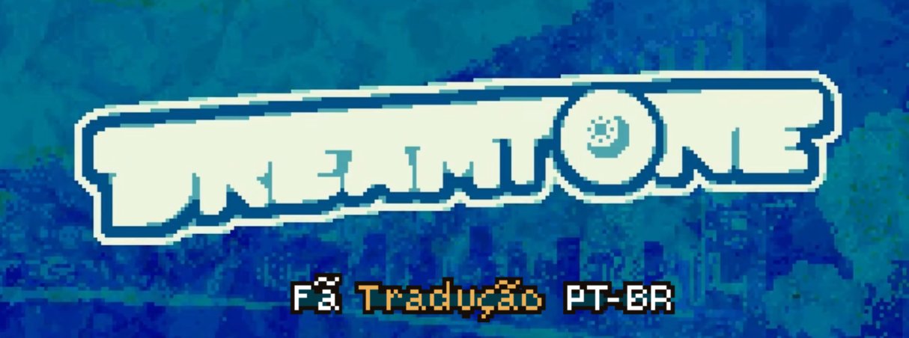

    

   🌕 DREAMTONE: Demo

  🇧🇷 Fã-tradução PT-BR  
  Jogo por: **Benichi**

 
 Este é um projeto de fã para fã, não é oficial e não temos qualquer relação com o Benichi. e sua equipe.  
   Recomendamos fortemente que você apoie o desenvolvedor e o projeto original.
  

---

## Como instalar a tradução
( Recomendo: faça backup dos arquivos originais antes de substituir. )
### Localize a pasta do jogo
- Primeiro, descubra onde o jogo está instalado (Downloads, Documentos ou Área de Trabalho).
- Se você usa a Steam:
  - Clique com o botão direito no jogo
  - Vá em **Gerenciar → Explorar arquivos locais**
###  Instale a tradução
- Abra a pasta onde o "DREAMTONE_Br" está instalado.
- extraia na pasta "DREAMTONE Demo"
- Quando aparecer a opção, clique em Substituir o arquivo no destino.
   ou
- Copie o arquivo `.pck` da tradução.
- Cole o arquivo dentro da pasta do jogo.
- Quando aparecer a opção, clique em Substituir o arquivo no destino.
### É isso!

## Créditos de Tradução
<b>PexPR</b> ▸ Tradução 〢 Revisão 
<b>Zoti</b> ▸ Tradução  〢 Sprites 
<b>Ramb</b> ▸ Sprites 
